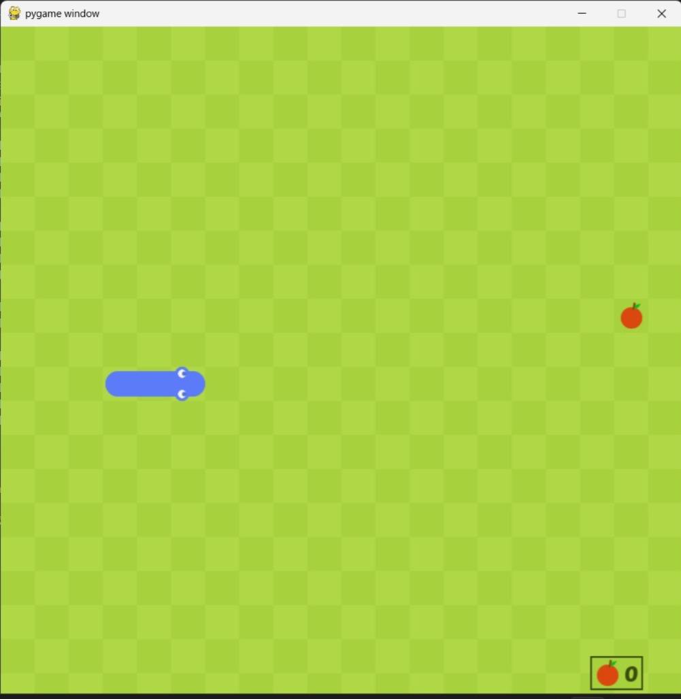

# 🐍 Snake Game

A modern version of the classic **Snake Game**, built using **Python** and **Pygame**. This project features smooth animations, an intuitive UI, and a fun gameplay experience.  



---

## 📌 Features

- ✅ **Smooth Animations** – Fluid snake movement and transitions.  
- ✅ **Classic Gameplay** – Eat apples to grow and increase score.  
- ✅ **Score Tracking** – Displays current score in the bottom-right corner.  
- ✅ **Minimalist UI** – Aesthetic grid-based green background.  
- ✅ **Keyboard Controls** – Easy to play with arrow keys.  

---

## 🚀 Installation & Setup

### 1️⃣ Prerequisites  
Ensure **Python** is installed on your system. You can download it from [python.org](https://www.python.org/downloads/).  

### 2️⃣ Install Dependencies  
Run the following command to install **Pygame**:  
```sh
pip install pygame
```

### 3️⃣ Clone the Repository  
```sh
git clone https://github.com/pritam-banik-roy/Snake_Games.git
cd Snake_Games
```

### 4️⃣ Run the Game  
```sh
python main.py
```

---

## 🎮 Controls

| Key            | Action         |
|---------------|---------------|
| ⬆️ Up Arrow   | Move Up       |
| ⬇️ Down Arrow | Move Down     |
| ⬅️ Left Arrow | Move Left     |
| ➡️ Right Arrow | Move Right   |
| 🔴 Esc        | Quit the game |

---

## 📸 Screenshots  

### 🎲 Game Start  
  

### 🍎 Eating Food  
  

---

## 🛠 Technologies Used  
- 🐍 **Python** – Core language for game logic  
- 🎮 **Pygame** – Library for graphics and game development  

---

## 🏆 Future Enhancements  
- 📌 **Sound Effects & Music** – Add background music and sound effects.  
- 📌 **Difficulty Levels** – Implement different speed levels.  
- 📌 **Leaderboard** – Store high scores for players.  

---

## 📝 License  
This project is **open-source** and available under the **MIT License**.  

---

## 👨‍💻 Author  
**Pritam Banik Roy**  
📧 [Email Me](mailto:pritambanikroy@gmail.com)  
🔗 [GitHub](https://github.com/pritam-banik-roy) | [LinkedIn](https://www.linkedin.com/in/pritam-banik-roy/)  

---

🚀 **Enjoy the game and happy coding!** 🐍🎮
